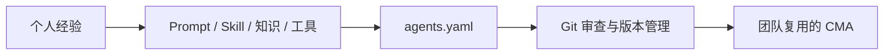
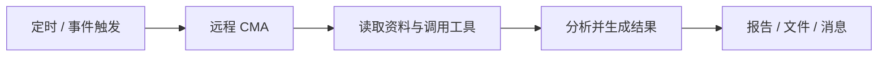

# OpenAgentPack 正式开源：让 CMA 成为团队里的远程同事

想象一下：每天早上 8 点，一个 Agent 已经在云端读完行业动态、内部资料和项目进展，整理好日报；新同事加入项目时，不必从头学习 Prompt 和工具配置，直接复用团队验证过的 Agent，就能按同一套方法工作。

这就是 CMA（Cloud Managed Agent，云端托管的远程 Agent）的价值：它不依赖某个人的电脑，可以持续工作；它沉淀的也不只是一次对话，而是整个团队可复用的知识与工作方法。

今天，我们正式开源 **OpenAgentPack**。它用 Git 和 YAML 管理 CMA，让远程 Agent 从“个人配置”变成可共享、可审查、可运行的团队资产。

项目地址：[GitHub - OpenAgentPack](https://github.com/modelstudioai/OpenAgentPack)

## 场景一：把一个人的经验，变成团队能力

假设一名研究员搭建了“行业研究 Agent”：它知道去哪里找资料、如何判断来源、按什么框架分析，以及怎样输出报告。

过去，这些经验散落在 Prompt、文件、Skill 和控制台配置里。换个人使用，往往要重新搭建；原作者离开后，Agent 甚至可能无人敢改。

OpenAgentPack 把模型、指令、工具、Skill、MCP、知识文件和运行环境收敛到一份 `agents.yaml`，并交给 Git 管理：



同事可以直接复用这套 Agent；专家更新分析方法时，通过 Pull Request 说明变化；效果不理想时，可以回到上一个稳定版本。知识不再只存在于人的脑中，而是成为能运行、能迭代、能交接的组织资产。

## 场景二：电脑关机，任务继续

很多工作并不需要人一直盯着：每天汇总舆情、每周生成项目周报、定期检查系统异常、收到事件后整理材料。

本地 Agent 一旦断网、休眠或关闭终端，任务就会中断。CMA 运行在远端环境中，可以通过定时或事件触发持续执行：



例如，团队可以声明一个“每日项目管家”：早上自动读取仓库变更和任务记录，归纳风险与待办，产出简报。成员上班后看到的是结果，而不是等待 Agent 在个人电脑上跑完。

OpenAgentPack 用 `deployment` 描述这类可重复任务，并把 Agent、运行环境、初始事件和调度统一管理。Qoder 与 Claude 支持服务端定时运行；其他平台也可通过外部 cron 或 CI 触发。

## 让远程 Agent 可控，才能放心交给它工作

无人值守不等于不可控。OpenAgentPack 提供一套类似 Terraform 的流程：

```text
同步已有 Agent → 修改声明 → validate → plan → apply → 远端运行
```

`plan` 会在变更发生前展示将创建、更新或删除什么；依赖按正确顺序执行，失败时跳过下游资源；远端被手动修改后，还能发现配置漂移。团队既能提高自动化程度，也保留审查、追溯和回滚能力。

目前，OpenAgentPack 已支持百炼、Qoder、Claude 和火山方舟。你可以先把控制台中已有的 Agent 同步回 Git，再逐步建立团队共享、自动运行和多平台迁移流程。

```bash
npm install -g @openagentpack/cli
agents init
agents validate && agents plan
```

CMA 的意义，不只是把 Agent 搬到云端，而是让它成为团队真正拥有的远程生产力：**知识可以传承，任务可以持续，变化始终可控。**
